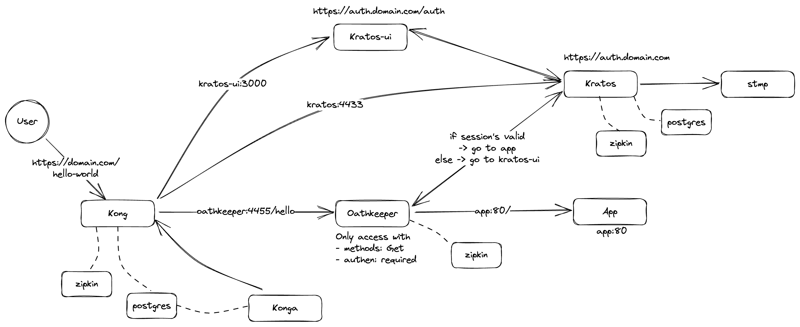

# Components

- common
    - postgres(v9.6): Database for kong, konga, ory-oathkeeper and ory-kratos
    - mailslurper: Fake SMTP server for testing
    - zipkin: Distributed tracing system
    - helloworld-http: Simple http server for testing
- kong
    - kong: API Gateway
    - konga: Kong GUI
- ory
    - ory-oathkeeper: Identity & Access Proxy
    - ory-kratos: Identity & User Management
    - kratos-selfservice-ui-node: Kratos GUI

# Usage

## Prerequisites
- Docker
## Important Notes
- Only run with https enabled 
- Only expose Kong gateway, Kratos UI and Kratos API to public (keep other components in private network: Kong Admin, Konga, Oathkeeper, App, DB, Kratos Admin)
- Name of session cookie is `session` with `SameSite=Srict` attribute
## Steps
- Review `./auth/config/*.yml` files and change to new domain
- Review email template in `./auth/templates` folder
- If you dont have postgres and testing tool, run `cd common && docker-compose up -d`
- Start kong, konga by `cd gateway && docker-compose up -d`
- Start ory-oathkeeper, ory-kratos by `cd auth && docker-compose up -d`
- Login to konga at `http://localhost:1337` with 